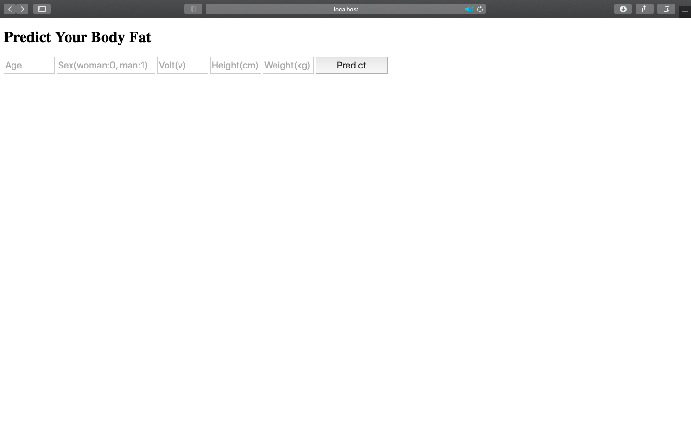
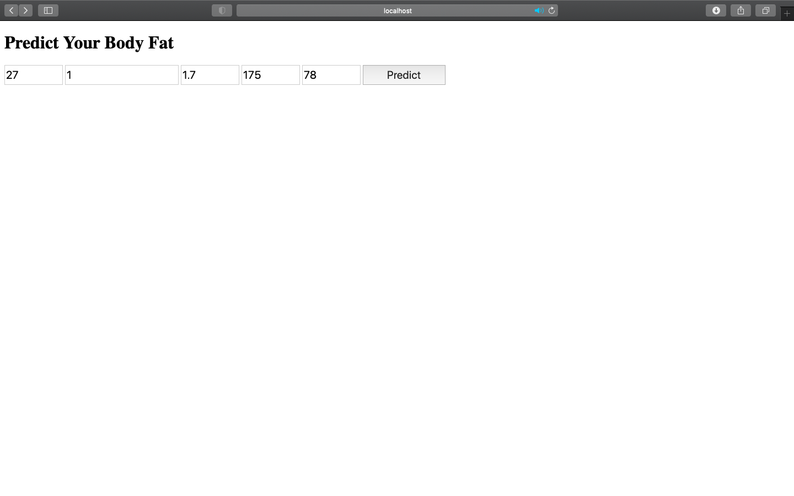
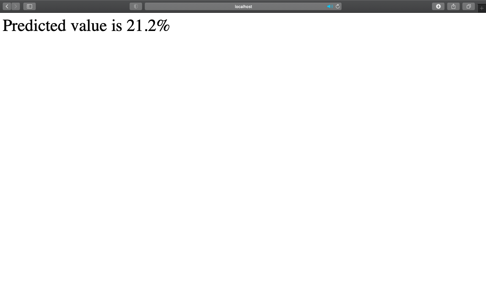

## 1. About
- It is a program that predicts body fat rate with simple body data using machine learning.

## 2. Environment
- Mac OS 10.14.6
- Python 3.8.3
- Conda 4.8.3

## 3. Installation
- xgboost 
    - !pip install xgboost 
    - !brew install libomp
- lightgbm 
    - !pip install lightgbm

## 4. Data
- format: .csv 
- distribution  
> |Data|Numbers|Ratio|
> |---|---|---|
> |train|684|0.8|
> |test|169|0.2|
> |total|853|1| 
- example 
> |Index|Age|Sex|Volt|Height|Weight|Standard_Weight|Body_Fat_Rate|
> |---|---|---|---|---|---|---|---|
> |0|23|0|1.35|167|62.8|60.3|31.9
> |1|20|1|1.15|183|75.1|74.7|12.6

## 5. Results
- 'Random Forest' shows the best performance. 
> |Model|MAE|MSE|RMSE|RMSLE|R2|
> |---|---|---|---|---|---|
> |Linear|2.607|10.876|3.298|0.149|0.829|
> |Ridge|2.627|11.071|3.327|0.151|0.826|
> |Lasso|2.618|10.987|3.315|0.151|0.827|
> |Elastic Net|2.686|11.675|3.417|0.156|0.816|
> |Decision Tree|2.533|13.278|3.644|0.147|0.791|
> |**Random Forest**|**2.044**|**8.298**|**2.881**|**0.118**|**0.870**|
> |Gradient Boosting|2.318|8.873|2.979|0.134|0.860|
> |XGB|2.267|9.307|3.051|0.133|0.854|
> |LGM|2.495|10.435|3.230|0.141|0.836|

## 6. Run on the Web
- download files
    - templates/index.html
    - templates/predict.html
- make the 'model.pkl' file
    - python3 make_pkl.py
- run the server
    - python3 app.py
- access to the web
    - localhost:5000
- Screenshots
    
    
    